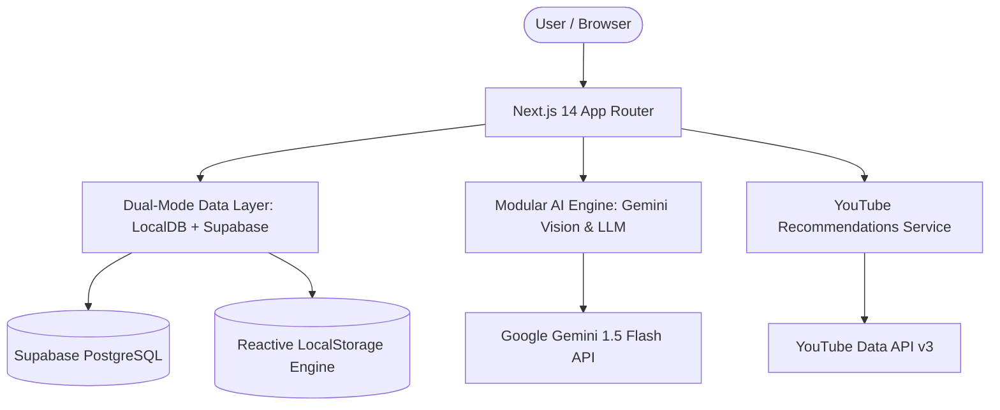

# 🌱 ReVIBE – AI-Powered Waste-to-Wealth Platform

<div align="center">


**Recycle Waste. Create Value. Inspire Change.**

*An intelligent circular economy platform that transforms discarded waste into creative DIY products, commercial micro-businesses, community inspiration, and verifiable environmental impact.*

</div>

---

## 📖 Table of Contents

- [Vision & Problem Statement](#-vision--problem-statement)
- [Key Features](#-key-features)
- [Architecture & Tech Stack](#-architecture--tech-stack)
- [User Journeys & Workflow](#-user-journeys--workflow)
- [Getting Started](#-getting-started)
- [Environment Configuration](#-environment-configuration)
- [Database Setup (Supabase)](#-database-setup-supabase)
- [Demo Credentials](#-demo-credentials)
- [Roadmap & Contributing](#-roadmap--contributing)
- [License](#-license)

---

## 🌍 Vision & Problem Statement

Over **2.01 billion tons** of municipal solid waste are generated globally each year. Discarded plastic, glass, cardboard, coconut shells, and textile scraps often end up in landfills simply because individuals lack immediate knowledge on how to upcycle them into value.

**ReVIBE** bridges multimodal computer vision, creative maker instructions, commercial viability calculations, and community circular trade:

$$\text{Waste Material} \xrightarrow{\text{Vision AI}} \text{Waste DNA \& Rescue Score} \xrightarrow{\text{DIY / Business AI}} \text{Finished Products} \xrightarrow{\text{Marketplace / Donation}} \text{Verifiable Eco Impact}$$

---

## ✨ Key Features

### 🔍 1. Multimodal Vision AI Scanner & Waste DNA
- **Instant Material Classification**: Upload any photo to detect material (PET/HDPE plastic, amber glass, corrugated cardboard, denim, coconut shell, etc.), contamination level, structural integrity, and condition.
- **Waste DNA Profile**: Calculates transformation potential (0–100%), reusability tiers, difficulty level, and estimated raw market value.
- **Waste Rescue Score**: Visual 100-point index evaluating recyclability, processing ease, and upcycling yield.

### 🎨 2. Dual-Engine Intelligence: Creative DIY & Business Mode
- **Creative DIY Blueprints**: Step-by-step assembly guides, required tools list, bill of materials, safety guidance, and time estimations.
- **Commercial Feasibility & Unit Economics**: Suggested retail pricing, production costs, profit margins ($>70\%$), target buyer personas, and market demand analysis.
- **Real-Time Profit Calculator**: Interactive cost/revenue slider with live gross margin projections.

### 🎬 3. Smart YouTube Video Tutorials
- **Dynamic Video Recommendations**: Real-time YouTube tutorials matching the scanned waste material and chosen DIY product.
- **Category Filter Chips**: Filter by *Upcycling Masterclasses, Gardening DIY, Home Decor, Planters, and Artisan Crafts*.
- **Integrated Watch Launcher**: Open direct tutorials and pre-filled YouTube search queries.

### 🧪 4. Waste Combination Lab ("Mix Your Waste")
- Combine multiple waste streams (e.g., *Plastic Bottle + Cardboard + Fabric Scraps*) to synthesize compound multi-material upcycling blueprints.

### ⏱️ 5. Challenge Arena ("Challenge Me")
- Daily timed maker sprints (15m, 30m, 45m, 60m) with customized constraints.
- **Vision AI Submission Verification**: Upload finished photos for AI evaluation against criteria, earning Eco Points and badges.

### 🖼️ 6. Before/After Transformation Stories
- Comparative dual-image showcase generating AI-crafted maker narratives and 1-click publishing to the community feed.

### 🛍️ 7. Circular Marketplace & Order Lifecycle
- Filter, search, and list upcycled creations with image previews, category tags, and wishlist bookmarks.
- **5-Stage Order State Machine**: `Pending` $\rightarrow$ `Accepted` $\rightarrow$ `Preparing` $\rightarrow$ `Ready` $\rightarrow$ `Completed` with instant buyer notifications.

### 🎁 8. Zero-Landfill Donation Hub
- List and claim free reusable scrap materials and finished products with location filters and pickup coordination.

### 👥 9. Community Feed & Inspiration Moodboards
- **Instagram-Style Community**: Like, comment, share, and bookmark upcycling transformations.
- **Pinterest Masonry Moodboard**: Filter ideas by material tags and curate private/public collection folders.

### 📊 10. Defensible LCA Impact Tracking & Gamification
- Aggregates verified records in `impact_events` table into:
  - $\text{kg}$ of waste diverted from landfills
  - Liters of clean water saved
  - $\text{kg}$ of $\text{CO}_2\text{e}$ avoided
- **6-Tier Badge Progression**: *Beginner Recycler $\rightarrow$ Upcycling Explorer $\rightarrow$ Waste Transformer $\rightarrow$ Eco Creator $\rightarrow$ Green Entrepreneur $\rightarrow$ ReVIBE Champion*.

### 🛡️ 11. Admin Platform Governance & Moderation
- Real-time platform metrics, product/post content moderation, and 1-click JSON platform audit report export.

### 💬 12. Floating AI Assistant
- Context-aware chatbot with quick prompt pills available across every page.

---

## 🏗️ Architecture & Tech Stack



- **Framework**: [Next.js 14](https://nextjs.org/) (App Router, Server Components & Route Handlers)
- **Language**: [TypeScript](https://www.typescriptlang.org/) (Strict mode, 100% type safety)
- **Styling**: [Tailwind CSS](https://tailwindcss.com/) (Warm off-white theme `#fbfbf9`, charcoal `#181f1c`, emerald accents `#059669`)
- **Icons & Motion**: [Lucide React](https://lucide.dev/), [Framer Motion](https://www.framer.com/motion/)
- **AI & Vision**: [@google/generative-ai](https://www.npmjs.com/package/@google/generative-ai) (Gemini Multimodal Vision API)
- **Database**: Dual-Mode PostgreSQL ([Supabase](https://supabase.com/)) + Reactive Browser Persistence Layer

---

## 🚀 Getting Started

### Prerequisites
- **Node.js**: v18.17+ or v20+
- **npm** or **pnpm** / **yarn**

### Installation

```bash
# 1. Clone repository
git clone https://github.com/makeshmanisha9-sys/revibe.git

# 2. Enter project directory
cd revibe

# 3. Install dependencies
npm install

# 4. Run development server
npm run dev
```

Visit [http://localhost:3000](http://localhost:3000) to open the application.

---

## ⚙️ Environment Configuration

Create a `.env.local` file in the project root:

```env
# Google Gemini API Key (Optional - application includes intelligent built-in fallback)
AI_API_KEY=your-gemini-api-key
GEMINI_API_KEY=your-gemini-api-key

# YouTube API Key (Optional - curated recommendation engine active by default)
YOUTUBE_API_KEY=your-youtube-api-key

# Supabase Credentials (Optional - persistent client store works out-of-the-box)
NEXT_PUBLIC_SUPABASE_URL=https://your-project.supabase.co
NEXT_PUBLIC_SUPABASE_ANON_KEY=your-supabase-anon-key
```

---

## 🗄️ Database Setup (Supabase)

To enable live cloud PostgreSQL sync:

1. Create a project at [supabase.com](https://supabase.com/).
2. Navigate to the **SQL Editor** in your Supabase dashboard.
3. Paste and run the full schema script from [`supabase/schema.sql`](supabase/schema.sql).
4. Add your `NEXT_PUBLIC_SUPABASE_URL` and `NEXT_PUBLIC_SUPABASE_ANON_KEY` to `.env.local`.

---

## 🔑 Demo Credentials

ReVIBE includes built-in test accounts for immediate 1-click preview:

| Role | Email | Capabilities |
| :--- | :--- | :--- |
| **Eco Creator (User)** | `aanya@revibe.eco` | Full AI scanner, DIY builder, sell products, post to community, claim donations. |
| **Platform Administrator** | `admin@revibe.eco` | Platform governance, listings moderation, community oversight, audit report export. |

*You can also click the 1-click **User Demo** or **Admin Demo** buttons directly on the `/login` page.*

---

## 📄 License

Distributed under the **MIT License**. See `LICENSE` for more information.

---

<div align="center">

Made with 💚 for a cleaner, sustainable, circular future.

**[ReVIBE Platform](http://localhost:3000)** • Recycle Waste. Create Value. Inspire Change.

</div>
